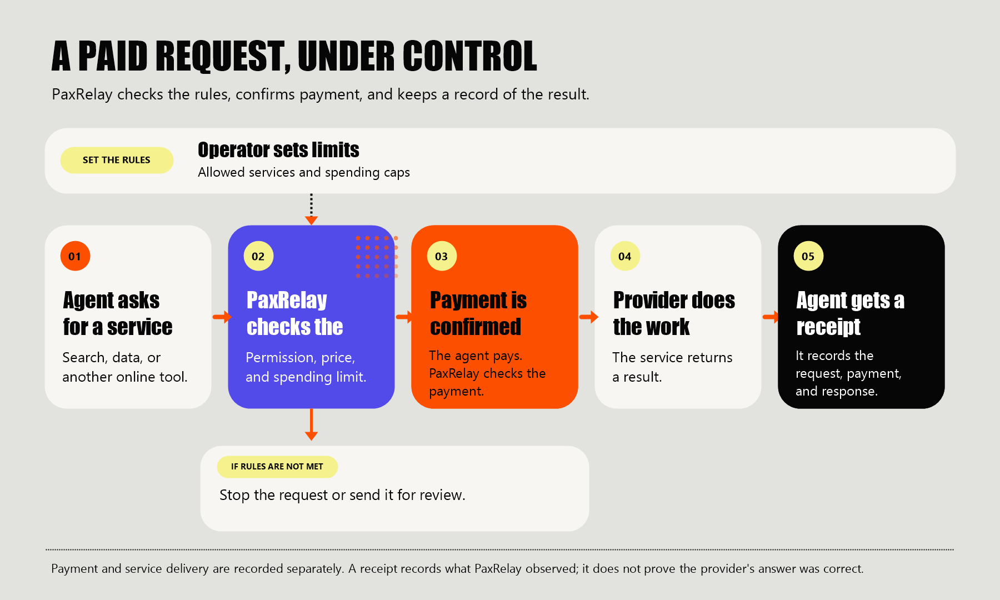

# PaxRelay

> PaxRelay helps teams set limits and keep track when AI agents pay to use online services.

PaxRelay is an independent developer project for agent-to-service payments on Paxeer Network. It is not an official Paxeer product.

## The problem

AI agents are software that can choose and use online tools. They may search the web, gather data, or use AI services. Some of those services charge for each use.

When an agent can spend money on its own, teams need clear answers:

- Was the agent allowed to make this purchase?
- Was the price within its limit?
- Which service handled the request?
- Did the provider return a result?
- What happened to the payment?

PaxRelay is being built to keep those decisions and records together.

## What PaxRelay does

PaxRelay sits between an AI agent and a paid service. It checks the agent's spending rules, chooses a suitable service, confirms payment, and records what happened.

Teams can use it to:

- Set spending limits and service permissions for each agent.
- Let service providers charge for use of their online tools.
- Choose a service using its price and past performance.
- See agent activity, payments, and service results in one place.
- Keep a receipt that records what PaxRelay observed during a request.

PaxRelay is designed to work with wallets controlled by customers and Paxeer's existing payment system. It coordinates those services; it does not replace them or take control of customer funds.

## How a request works

A receipt is a record of the request, payment, provider, and response that PaxRelay observed. It helps explain what happened. It does not prove that a provider's answer was correct.

## Who it is for

- **Teams building AI agents** that need to buy services safely.
- **Service providers** who want to charge for using their online services or tools.
- **Operators** who need to understand and control agent spending.

## The important idea

A successful payment does not guarantee that a service delivered a successful result. PaxRelay keeps payment and service delivery as separate parts of the record, so teams can see both.

## Current status

PaxRelay is pre-alpha. The repository contains early code for coordinating requests and payments, a dashboard preview, and a local practice simulator. Most dashboard areas still show sample information; the Agents, Policies, Providers, Services, Receipts, Analytics, and Transactions pages can read workspace data with the matching access key. The Agents page can also register agents when the key has permission to both view and create them. The Providers page can register provider profiles when the key can create them; production profiles need a payment wallet address. Provider records do not show live service health or performance. Settings can list, create, and revoke project API keys; a new key is shown once so it can be saved securely. Other workspace preferences are not connected yet. The Services page shows registered service details, prices, and configured probe settings; it does not show the latest health-probe result. The Receipts page lists recent receipt summaries and signature evidence; it does not verify the signatures. The Approvals page can read requests and record a confirmed approve or reject decision with one API key that has both required permissions. Approval lets a request continue to payment checks; it does not make a payment. The Policies page can create rules, show full rule and assignment details, and assign a policy to an agent by ID. Some stored policy settings are not enforced yet, and the gateway does not supply failure history. The simulator uses made-up payment results, and external payment-network integration still needs validation.

Parts of the project are being reorganized. This checkout is not yet ready to run as one complete product. Developers can find local setup and detailed implementation notes in the [technical documentation](docs/TECHNICAL.md).

## Author

**Samuel Justin Ifiezibe** 
